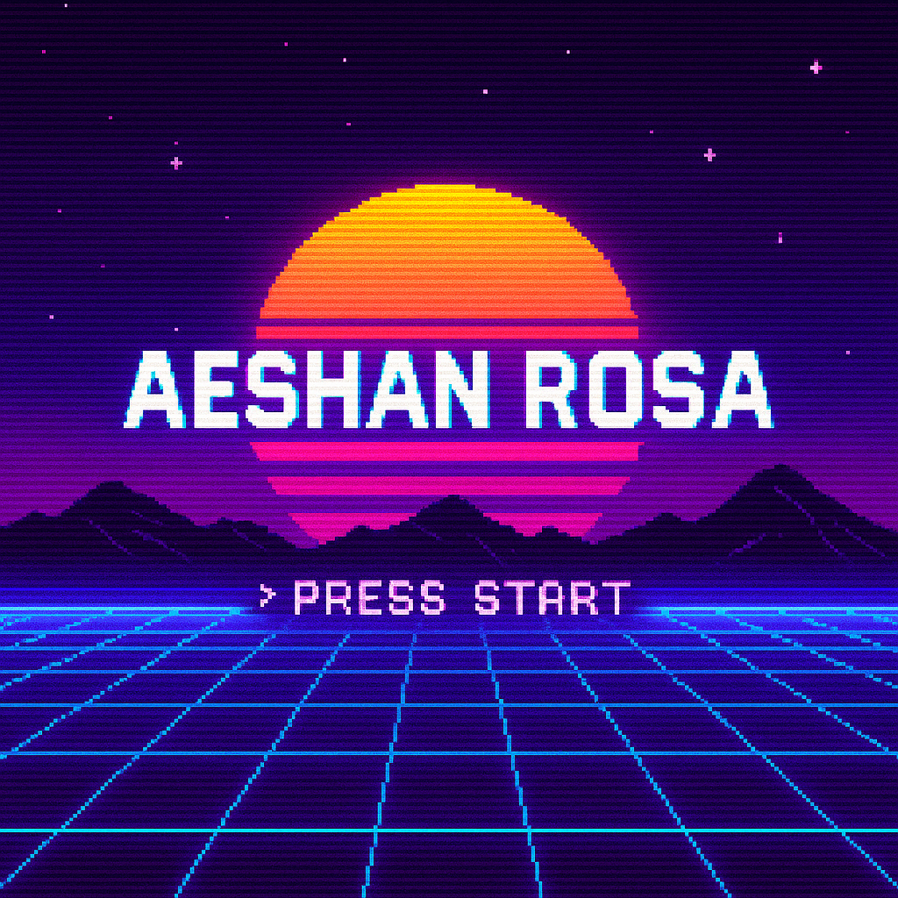

<!-- 🔮 Animated banner -->

  

<h1 align="center">💻 Welcome to My GitHub Profile!</h1>

  <samp>PRESS START TO ENTER · INSERT COIN</samp> 
  <samp>CREATING · CODING · LEVELING UP</samp>

░▒▓██████████████████████████████████▓▒░

## 👋 About Me
Hey there! I'm **Aeshan Rosa**, a passionate **Computer Science student** 🚀 who loves coding, problem-solving, and building impactful projects.  
I aspire to become a **Software Engineer** ✈️ and a **Game Engineer** 🎮, and I enjoy creating both **functional** and **creative** applications.

---

## 🛠️ Tech Stack & Skills

  
  
  
  
  
  
  

---

## ⚔️ Current Quests
- 🚌 Developing a **Bus Rescheduling & Optimization System** using Spring Boot + React  
- 🧠 Building **AI Agents** to assist users and automate tasks  
- 🎵 Running **Piano House of Sri Lanka** and exploring creative tech × music  
- 🌊 Designing interactive, story-driven websites like **SDG Life Below Water**

---

## 📟 GitHub Stats (Retro HUD)

  
  

  

---

## 🐍 Contribution Snake

  

> 🧩 *(Enable the GitHub Action below once you fork or create the repo.)*

---

## 📫 Connect With Me
- 💼 [LinkedIn](https://www.linkedin.com/in/aeshan-rosa-8383212a3)
- 🌐 Portfolio: *Still in the works*
- ✉️ **aeshaneruditharosa@gmail.com**

---

░▒▓██████████████████████████████████▓▒░

  <samp>💖 Thanks for visiting my profile! Let's code and create amazing things together! 🚀</samp>

  <samp>© 2025 AESHAN ROSA · PRESS START</samp>

