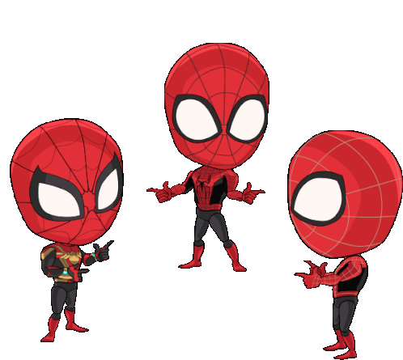

<!-- 🔮 Animated banner -->
<!-- this is just for now -->

  

<h1 align="center">💻 Welcome to My GitHub Profile!</h1>

  <samp>PRESS START TO ENTER · INSERT COIN</samp> 
  <samp>CREATING · CODING · LEVELING UP</samp>
  <samp>EATING · SLEEPING · CODING</samp>

░▒▓██████████████████████████████████▓▒░

---

  <h1 align="center">Hi , I am Aeshan Rosa </h1>
  

  Hey there! I’m <b>Aeshan Rosa</b>, a dedicated Computer Science student 🚀 with a deep passion for technology, creativity, and innovation.  
  I thrive on transforming ideas into reality through code, design, and logic, crafting projects that not only work but make a real impact.  
  💡 My interests span across software engineering, game development, and AI-driven systems, where I constantly explore new tools, frameworks, and creative problem-solving methods.  
  🎯 My ultimate goal is to become both a Software Engineer ✈️ who builds scalable, reliable systems and a Game Engineer 🎮 who brings imagination to life through engaging gameplay and meaningful storytelling.  
  When I’m not coding, you’ll often find me learning about emerging tech, brainstorming project ideas, or fine-tuning my creative side through music, design, and leadership initiatives.
  

---

## 🛠️ Tech Stack & Skills

  <!-- Programming Languages -->
  
  
  
  
  

  <!-- Frameworks -->
  
  
  
  
  

  <!-- Databases & Tools -->
  
  
  

  <!-- DevOps & Tools -->
  
  
  
  

  <!-- AI & ML -->
  
  

---

## ⚔️ Current Quests

🚌 Bus Rescheduling System – Built with Spring Boot + React, handles real-time bus breakdowns, adaptive rescheduling, and optimized trip allocation.

🤖 AI Assistants – Created smart agents to guide non-technical users and automate tasks like complaints and scheduling.

💾 Smart Inventory Manager – Java + MySQL system for tracking buyers, workers, and commissions with automated reports.

🌐 Creative Web & Mobile Projects –
UpSpring (Down Syndrome support), Streaky (habit app with streaks), and Life Below Water (animated SDG site).

🧩 Open Source Contributions – Contributed to WSO2 Identity Server Docs, adding missing OIDC DCR guides and improving structure.

🎮 Game & App Engineering – Exploring Unity, C#, and AI-powered gameplay to merge creativity with logic.

🚀 Learning & Research – Expanding expertise in AI, ML, MLOps, and full-stack development to build impactful real-world systems.

---

░▒▓██████████████████████████████████▓▒░

## 🏷️ Badges

  

░▒▓██████████████████████████████████▓▒░

  

## 📟 GitHub Stats
<!-- 🕹️ GITHUB STATS – NEON ARCADE STYLE -->
<!-- 🕹️ GITHUB STATS – NEON ARCADE STYLE -->
<h2 align="center">🎮 Player Stats: Aeshan Rosa</h2>

  <table align="center" border="0" cellspacing="0" cellpadding="0">
    <tr>
      <td align="center" width="120" valign="middle">
        
      </td>
      <td align="center" valign="middle">
        
        
      </td>
      <td align="center" width="120" valign="middle">
        
      </td>
    </tr>
  </table>

  

  

  

<!-- ⚡ ACTIVITY GRAPH -->
<h3 align="center">⚡ Activity Timeline graph</h3>

  

<!-- 🧩 EXTRA GAME ELEMENTS -->
<h3 align="center">💾 XP Dashboard</h3>

  
  
  

<!-- 🕹️ END PANEL -->
<h3 align="center">👾 Continue Your Quest...</h3>

  

---

## 🐍 Contribution Snake

  

---

## 📫 Connect With Me

  
  
  

  

  

  

---

░▒▓██████████████████████████████████▓▒░

  <samp>💖 Thanks for visiting my profile! Let's code and create amazing things together! 🚀</samp>

  <samp>© 2025 AESHAN ROSA · PRESS START</samp>

