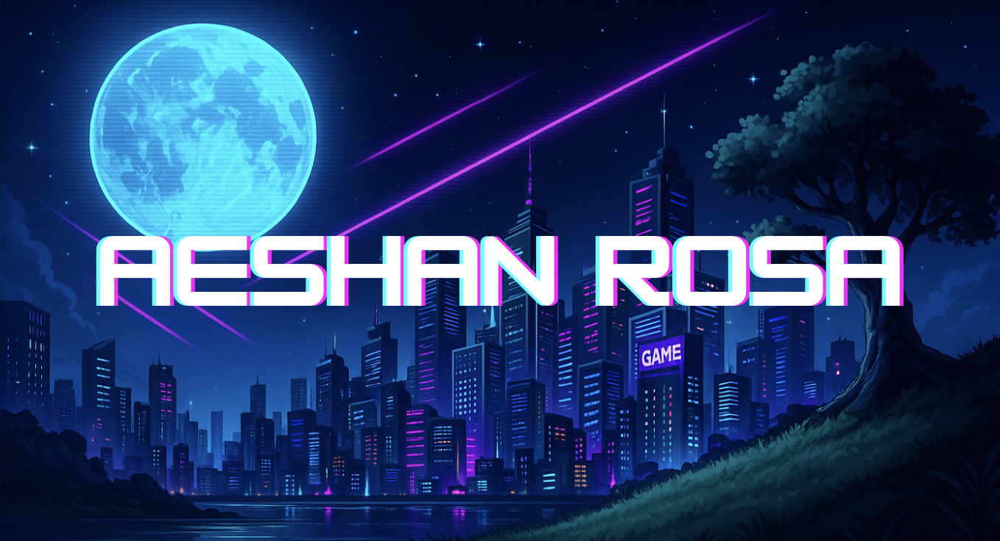

<!-- 🔮 Animated banner -->
<!-- this is just for now -->

  

<h1 align="center">💻 Welcome to My GitHub Profile!</h1>

  <samp>PRESS START TO ENTER · INSERT COIN</samp> 
  <samp>CREATING · CODING · LEVELING UP</samp>

░▒▓██████████████████████████████████▓▒░

<!-- === NEON CONSOLE x GLOW CARD – ABOUT ME === -->

  <h2 style="
    color:#00FFFF;
    font-weight:800;
    letter-spacing:1.5px;
    margin: 6px 0 14px 0;
    text-shadow: 0 0 6px #00FFFF, 0 0 14px rgba(0,255,255,0.5);
  ">👋 About Me</h2>

  <!-- Neon Console Header -->
  

<pre style="margin:0; white-space:pre-wrap; text-align:left;">
🮠<b>System Booting</b>: ABOUT_ME
────────────────────────────────────────────────────────
🧠 <b>Name</b>: Aeshan Rosa
💻 <b>Role</b>: Computer Science Student
⚡ <b>Mode</b>: Creative · Technical · Curious
────────────────────────────────────────────────────────
</pre>
  

  <!-- Main Text (your original content, styled) -->
  

    

      Hey there! I’m <b>Aeshan Rosa</b>, a dedicated <b>Computer Science student</b> 🚀 with a deep passion for technology, creativity, and innovation.
      I thrive on transforming ideas into reality through code, design, and logic, crafting projects that not only work but make a real impact.
    

    

      💡 My interests span across <b>software engineering</b>, <b>game development</b>, and <b>AI-driven systems</b>, where I constantly explore new tools, frameworks, and creative problem-solving methods.
      I love diving deep into backend architectures, building intuitive user interfaces, and experimenting with interactive and immersive digital experiences.
    

    

      🎯 My ultimate goal is to become both a <b>Software Engineer ✈️</b> who builds scalable, reliable systems and a <b>Game Engineer 🎮</b> who brings imagination to life through engaging gameplay and meaningful storytelling.
    

    

      When I’m not coding, you’ll often find me learning about emerging tech, brainstorming project ideas, or fine-tuning my creative side through music, design, and leadership initiatives.
    

  

  <!-- Neon Divider -->
  

  <!-- Footer Console Badges -->
  

    🧩 Problem Solver
    🨠Creative Coder
    🧠 AI & Backend
    🮠Game Dev
  

<!-- === / END NEON CONSOLE x GLOW CARD === -->

---

## 🛠️ Tech Stack & Skills

  
  
  
  
  
  
  

---

## ⚔️ Current Quests

🚌 Bus Rescheduling System – Built with Spring Boot + React, handles real-time bus breakdowns, adaptive rescheduling, and optimized trip allocation.

🤖 AI Assistants – Created smart agents to guide non-technical users and automate tasks like complaints and scheduling.

💾 Smart Inventory Manager – Java + MySQL system for tracking buyers, workers, and commissions with automated reports.

🌐 Creative Web & Mobile Projects –
UpSpring (Down Syndrome support), Streaky (habit app with streaks), and Life Below Water (animated SDG site).

🧩 Open Source Contributions – Contributed to WSO2 Identity Server Docs, adding missing OIDC DCR guides and improving structure.

🎮 Game & App Engineering – Exploring Unity, C#, and AI-powered gameplay to merge creativity with logic.

🚀 Learning & Research – Expanding expertise in AI, ML, MLOps, and full-stack development to build impactful real-world systems.

---

░▒▓██████████████████████████████████▓▒░

## 🏷️ Badges

  

░▒▓██████████████████████████████████▓▒░

---

## 📟 GitHub Stats
<!-- 🕹️ GITHUB STATS – NEON ARCADE STYLE -->
<h2 align="center">🮠Player Stats: Aeshan Rosa</h2>

  
  

  

<!-- ⚡ ACTIVITY GRAPH -->
<h3 align="center">⚡ Activity Timeline</h3>

  

<!-- 🧩 EXTRA GAME ELEMENTS -->
<h3 align="center">💾 XP Dashboard</h3>

  
  
  

<!-- 🕹️ END PANEL -->
<h3 align="center">👾 Continue Your Quest...</h3>

  

---

## 🐍 Contribution Snake

  

---

## 📫 Connect With Me

  
  
  

  

  

  

---

░▒▓██████████████████████████████████▓▒░

  <samp>💖 Thanks for visiting my profile! Let's code and create amazing things together! 🚀</samp>

  <samp>© 2025 AESHAN ROSA · PRESS START</samp>

